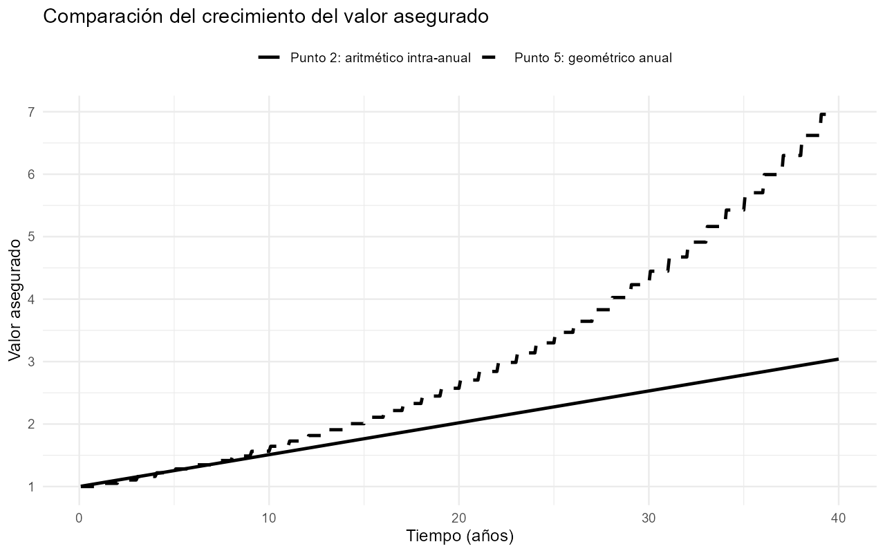
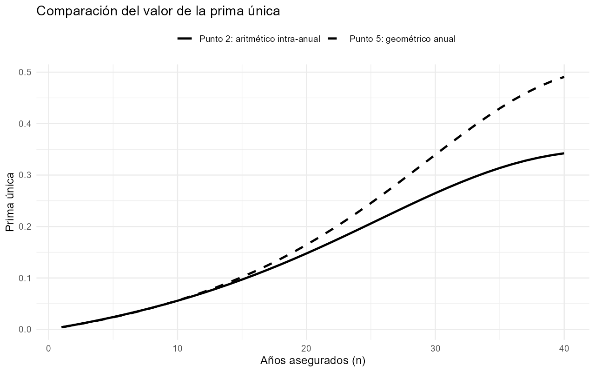
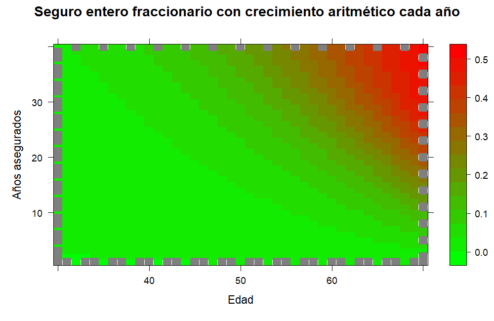
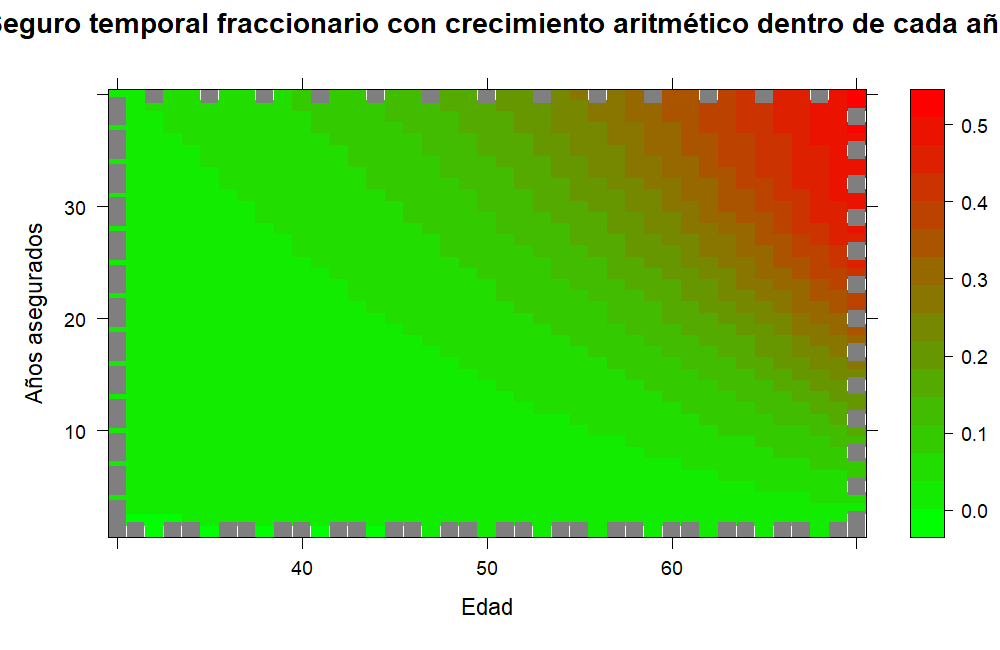
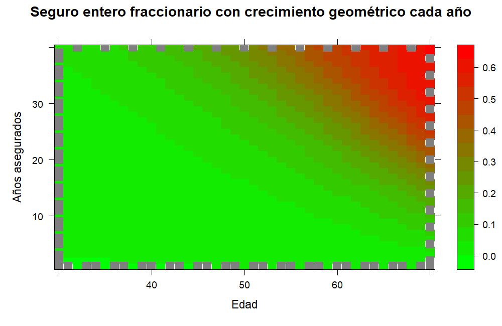
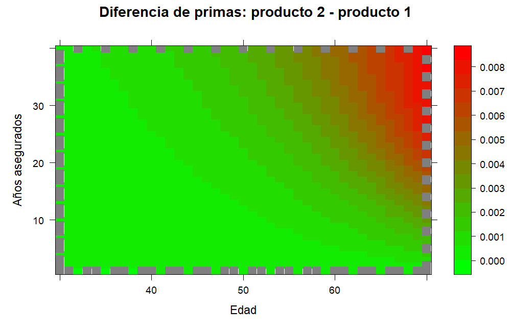
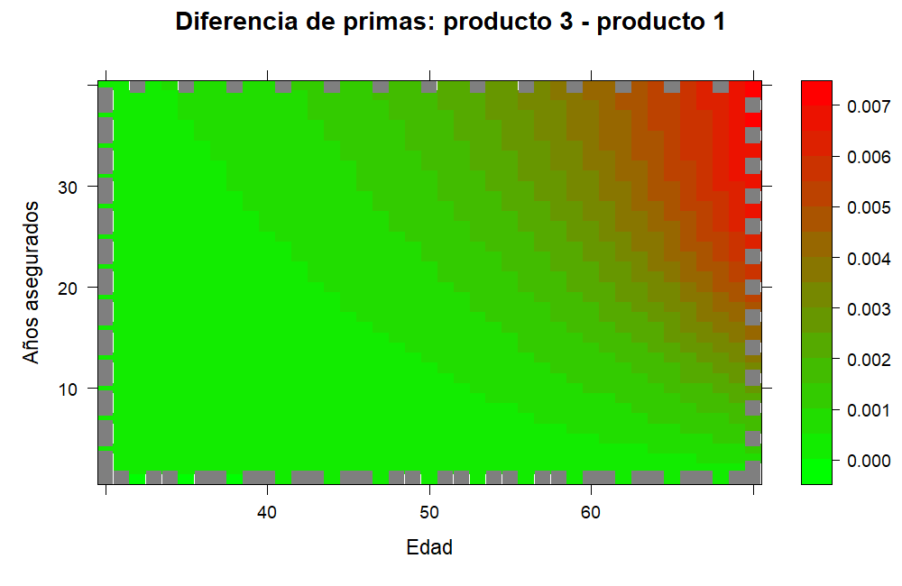
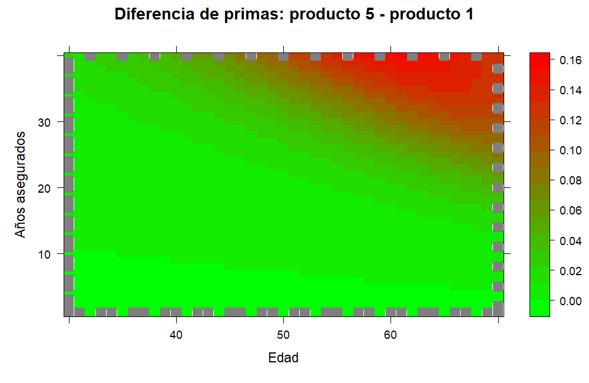

# Life Contingencies UNAL

Toolkit en R para valorar seguros de vida individuales usando la Tabla Colombiana de Mortalidad de Asegurados 1998–2003. El proyecto calcula primas únicas mediante dos enfoques: funciones analíticas específicas para cada producto y un motor general numérico (`get_premium_insurance`) que evalúa explícitamente la suma esperada del beneficio descontado.

El taller completo está desarrollado en [`Taller_1.Rmd`](Taller_1.Rmd). El HTML renderizado, cuando esté disponible, se encuentra en [`Taller_1.html`](Taller_1.html).

## Productos valorados

El taller calcula primas para cinco productos:

1. Seguro entero fraccionario con crecimiento aritmético anual del valor asegurado.
2. Seguro entero fraccionario con crecimiento aritmético intra-anual del valor asegurado.
3. Seguro temporal fraccionario con crecimiento aritmético intra-anual del valor asegurado.
4. Seguro dotal, construido agregando un seguro dotal puro al producto 3.
5. Seguro entero fraccionario con crecimiento geométrico anual del valor asegurado.

## Datos y parámetros base

- Tabla colombiana de mortalidad de asegurados 1998–2003, tomada de la Resolución 1555 de 2010.
- Tasa de crecimiento del valor asegurado: inflación de 5.1%.
- Tasa real: 2.5%.
- Tasa técnica nominal por composición tipo Fisher:

```r
inflation <- 0.051
real_interest <- 0.025
nominal_interest <- (1 + inflation) * (1 + real_interest) - 1
```

La tabla de mortalidad se procesa desde `res-1555-2010.pdf`, se transforma en una tabla actuarial con probabilidades de muerte, sobrevivientes, fallecimientos esperados y funciones de conmutación.

## Estructura del repositorio

- `general_functions.R`: procesamiento de la tabla de mortalidad y funciones auxiliares.
- `life_ensurance.R`: motor general de pricing (`get_premium_insurance`) y lógica de enrutamiento por casos.
- `specific_functions.R`: funciones cerradas para productos específicos (`price_case_11`, `price_case_25`, `price_case_09_term`, `Problem4`, `price_case_15`).
- `general_graphs.R`: funciones para visualización, mapas de calor y comparaciones.
- `set_cases.R`: construcción de la tabla cartesiana de casos de producto.
- `Taller_1.Rmd`: documento principal del taller.
- `main.R`: script principal de ejecución y pruebas.
- `generate_readme_plots.R`: script para generar las imágenes estáticas usadas en este README.
- `playground.R`: archivo auxiliar para pruebas y debugging.
- `instructions.pdf`: enunciado original del taller.
- `res-1555-2010.pdf`: tabla de mortalidad base.
- `plots/`: carpeta con esquemas de productos e imágenes generadas para el README.
- `.gitignore`: exclusiones de control de versiones.

## Uso básico

Clonar el repositorio y ejecutar el documento principal:

```r
rmarkdown::render("Taller_1.Rmd")
```

También se puede ejecutar el script principal:

```r
source("main.R")
```

Para regenerar las imágenes estáticas que aparecen en este README:

```r
source("generate_readme_plots.R")
```

## Comparaciones visuales

### Crecimiento del valor asegurado: producto 2 vs producto 5



### Prima única por plazo: producto 2 vs producto 5



## Mapas de calor de primas

### Producto 1: seguro entero fraccionario con crecimiento aritmético anual



### Producto 2: seguro entero fraccionario con crecimiento aritmético intra-anual


### Producto 3: seguro temporal fraccionario con crecimiento aritmético intra-anual



### Producto 5: seguro entero fraccionario con crecimiento geométrico anual



## Diferencias frente al producto 1

### Producto 2 menos producto 1



### Producto 3 menos producto 1



### Producto 5 menos producto 1



## Nota sobre el README

GitHub no ejecuta automáticamente los chunks de R Markdown dentro del README. Por eso, las gráficas deben generarse previamente y guardarse como archivos `.png` dentro de `plots/`. El script `generate_readme_plots.R` automatiza ese proceso.
