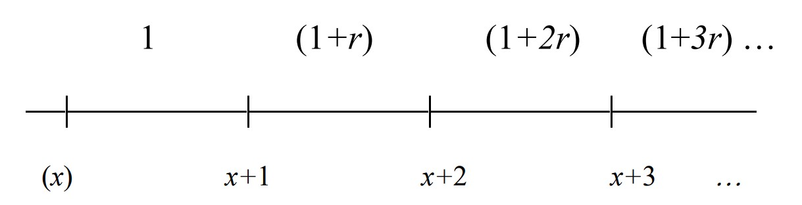
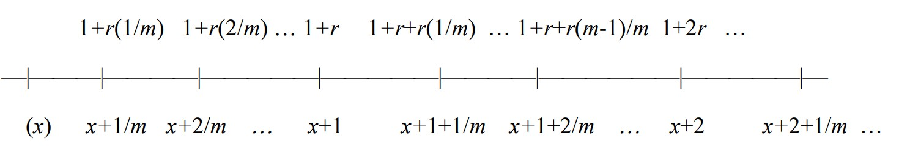
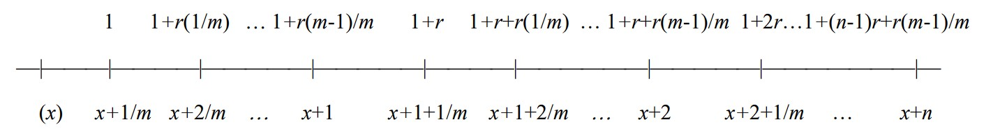

```{r setup, include=FALSE}
knitr::opts_chunk$set(echo = TRUE)
```

# Introducción {#intro}

En este documento se calculan las primas de distintos seguros de vida y se elaboran algunas comparaciones. 

Se emplean dos enfoques para calcular las primas: primero, se resuelve cada problema de forma analítica y se programa **una función por producto**; segundo, se programa una función con suficientes parámetros para calcular la prima de cualquier producto. Esta función calcula los valores esperados de forma explícita: vectorizando los componentes (descuento, pago y probabilidad) y resolviendo la sumatoria. Se hiceron pruebas unitarias para determinar que el resultado por ambas vías es el mismo. 

Este documento constan de cinco secciones. Primero, esta introducción; segundo, una lista de datos y parámetros empleados; tercero, una sección sobre la lectura y procesamiento de datos; cuarto ---lo central para el taller--- el desarrollo algebráico de cada producto y la ejecución de las funciones específicas; quinto, resultados general y comparaciones, y sexto, explicación de la organización del repositorio. 

Este proyecto se realizó en R y está disponible en el siguiente repositorio de Github: <i class="fa fa-github"></i> [life_contingencies_unal](https://github.com/Joan-Robles/life_contingencies_unal)

# Datos y parámetros {#data}

- Tabla colombiana de mortalidad de asegurados 1998-2003. Extraída de la   resolución 1555 DE 2010. Contiene información para edades desde los 15 hasta los 110 años. 
- Tasa de crecimiento $r$ del valor asegurado de 5.1\%, correspondiente a la inflación. Se define así para mantener el poder adquisitivo del valor asegurado.
- Tasa de interés técnica de 7.73\%, correspondiente a la composición de interés real e inflación. 
- La persona asegurada, con la que se evalúan los productos de la sección de [funciones específicas](#products), es una mujer de 60 años. Para los seguro temporales, la temporalidad base es 40 años. En la sección de [resultados y comparaciones](#results) se evalúan otras edades y horizontes de cobertura.

```{r warning=FALSE}
inflation <- 0.051
real_interest <- 0.025
# Ecuación de Fisher
nominal_interest <- (1 + inflation) * (1 + real_interest) - 1
print(round(nominal_interest * 100, 2))
```

Otros parámetros y paquetes:
```{r parameters}
# seed
seed <- 123
set.seed(seed)

# dependencies
source("general_functions.R")
source("life_ensurance.R")
source("specific_functions.R")

# for plotting
file_path <- file.path(getwd(), "res-1555-2010.pdf")
x_values <- 30:70
n_values <- 1:40

# baseline
m <- 12 # like months
gender <- "women"
age <- 60
base_n <- max(n_values)
```

Se emplea el paquete `pacman` para cargar paquetes e instalar lo que falte:
```{r packages, message=TRUE}
# Install pacman if not available
if (!requireNamespace("pacman", quietly = TRUE)) {
  install.packages("pacman")
}

# Load (and install if needed) packages
pacman::p_load(
  dplyr,
  parallel,
  pdftools,
  plotly,
  ggplot2
)
```


# Procesamiento de la tabla de mortalidad {#process}

La función process_mortality_table toma el texto bruto de la tabla de mortalidad y lo convierte en una tabla actuarial lista para valorar seguros. Primero identifica las filas numéricas del documento, limpia separadores, extrae los valores relevantes y conserva las columnas de edad y probabilidades anuales de muerte por sexo: $q_x^{(h)}$ y $q_x^{(m)}$.

Luego construye una tabla de vida con radix inicial de 100000 para hombres y mujeres. Para cada edad calcula el número esperado de fallecimientos y sobrevivientes mediante:

$$d_x = l_x q_x$$

$$l_{x+1} = l_x - d_x$$

Con la tasa de interés técnico $$i$$ define el factor de descuento:

$$v = \frac{1}{1+i}$$

A partir de allí agrega las funciones de conmutación necesarias para valorar seguros:

$$D_x = l_x v^x$$

$$C_x = D_x v q_x = d_x v^{x+1}$$

Después calcula las sumas acumuladas:

$$M_x = \sum_{k=x}^{\omega} C_k$$

$$R_x = \sum_{k=x}^{\omega} M_k$$

Estas magnitudes permiten obtener directamente primas únicas clásicas. En particular:

$$A_x = \frac{M_x}{D_x}$$

corresponde al seguro entero unitario, mientras que:

$$(IA)_x = \frac{R_x}{D_x}$$

corresponde al seguro entero con crecimiento aritmético del beneficio. Estas nuevas columnas se emplean en las funciones específicas definidas más adelante. 

```{r tabla_mortalidad}
# read mortality table
.mortality_file <- pdftools::pdf_text(file_path)[2]
mortality_table <- process_mortality_table(.mortality_file, nominal_interest) %>% 
  as.data.frame()

# show
head(mortality_table, 10)
```

---
# Productos {#products}
Antes de construir la función correspondiente a cada producto, se hizo una lista de todas las posibilidades. La lista corresponde a todas las combinaciones de parámetros de `get_premium_insurance`. Los parámetros son: La variable `frac_pay` indica si el pago del seguro se realiza de manera fraccionada (TRUE) o anual (FALSE). Por su parte, `frac_value` señala si el valor asegurado crece dentro del año (TRUE) o únicamente entre años (FALSE). El parámetro `growth` define la forma del crecimiento del beneficio, pudiendo ser aritmético ("arithmetic") o geométrico ("geometric"). La variable `r_case` distingue entre ausencia de crecimiento ("zero", cuando r = 0) y presencia de crecimiento ("nonzero"). Finalmente, `initial_payment` especifica si el esquema comienza en el nivel base ("a") o incorpora el primer incremento desde el inicio ("b"). Cada combinación posible de estas características define un producto distinto, identificado de manera única mediante un índice.

```{r cases_table}
# read mortality table
case_table <- get_case_table()

# show
case_table
```
Por tanto, cada producto tiene un identificador y la función corrspondiente se nombra con este identificador. Por ejemplo, el producto del punto 1 corresponde a la combinación de parámetros 11 en la tabla de casos.

El resto de esta sección está dedicado a exhibir el desarrollo algebráico de cada producto y mostrar el uso de la función específica construida. Las funciones se prueban para los parámetros de la sección de [parámetros](#data). El usuario puede cambiar los parámetros y ejecutar nuevamente el _Markdown_ para probarlo.  

## Punto 1


```{r, echo=FALSE, out.width="50%", fig.align="center"}

```


Prima de un seguro entero fraccionario con crecimiento del valor asegurado con patrón aritmético cada año. Para este punto se usa la función específica `price_case_11()` definida en `specific_functions.R`. El desarrollo algebráico es:

\[
i^{(m)} = m\left((1+i)^{1/m}-1\right)
\]

\[
P_1 = \frac{i}{i^{(m)}}\left[A_x + r\left((IA)_x - A_x\right)\right]
\]

\[
P_1 = \frac{i}{i^{(m)}}\left[(1-r)A_x + r(IA)_x\right]
\]


```{r punto_1}
premium_1 <- price_case_11(
  x = age,
  m = m,
  r = inflation,
  .mortality_file = .mortality_file,
  gender = gender,
  interest = nominal_interest
)

cat("Valor de la prima:", premium_1)
```

## Punto 2

```{r, echo=FALSE, out.width="50%", fig.align="center"}

```

Prima de un seguro entero fraccionario con crecimiento del valor asegurado con patrón aritmético dentro de cada año.
Para este punto se usa la función específica `price_case_25()` definida en `specific_functions.R`. El desarrollo algebráico es:

\[
i^{(m)} = m\left((1+i)^{1/m}-1\right)
\]

\[
P_2
=
\frac{i}{i^{(m)}}\left[(1-r)A_x+r(IA)_x\right]
+
r\frac{i-i^{(m)}}{(i^{(m)})^2}A_x
+
\frac{r}{m}\frac{i}{i^{(m)}}A_x
\]

\[
P_2
=
\frac{i}{i^{(m)}}\left[(1-r)A_x+r(IA)_x\right]
+
r\left[
\frac{i-i^{(m)}}{(i^{(m)})^2}
+
\frac{i}{m i^{(m)}}
\right]A_x
\]

```{r punto_2}
premium_2 <- price_case_25(
  x = age,
  m = m,
  r = inflation,
  .mortality_file = .mortality_file,
  gender = gender,
  interest = nominal_interest
)

cat("Valor de la prima:", premium_2)
```

## Punto 3


```{r, echo=FALSE, out.width="70%", fig.align="center"}

```

Prima de un seguro temporal fraccionario con crecimiento del valor asegurado con patrón aritmético dentro de cada año.
La función específica de este punto está definida en `specific_functions.R` como `price_case_09_term()`. El desarrollo algebráico es:

\[
i^{(m)} = m\left((1+i)^{1/m}-1\right)
\]

\[
A_{x:\overline{n}|}
=
\sum_{k=1}^{n} v^k \, {}_{k-1}p_x q_{x+k-1}
\]

\[
(IA)_{x:\overline{n}|}
=
\sum_{k=1}^{n} k v^k \, {}_{k-1}p_x q_{x+k-1}
\]

\[
P_3
=
\frac{i}{i^{(m)}}\left[(1-r)A_{x:\overline{n}|}
+
r(IA)_{x:\overline{n}|}\right]
+
r\frac{i-i^{(m)}}{(i^{(m)})^2}A_{x:\overline{n}|}
\]

```{r punto_3}
premium_3 <- price_case_09_term(
  x = age,
  n = base_n,
  m = m,
  r = inflation,
  .mortality_file = .mortality_file,
  gender = gender,
  interest = nominal_interest
)

cat("Valor de la prima:", premium_3)
```

## Punto 4

Prima de un seguro dotal, obtenido al agregar un seguro dotal puro al anterior.
La función disponible en el repositorio para este punto está definida en `specific_functions.R` con el nombre `Problem4()`. El desarrollo algebráico es: 

\[
{}_{n}E_x = v^n \, {}_np_x
\]

\[
{}_{n}p_x
=
\prod_{j=0}^{n-1}(1-q_{x+j})
\]

\[
P_4
=
{}_{n}E_x + P_3
\]

\[
P_4
=
v^n\,{}_{n}p_x
+
\frac{i}{i^{(m)}}\left[(1-r)A_{x:\overline{n}|}
+
r(IA)_{x:\overline{n}|}\right]
+
r\frac{i-i^{(m)}}{(i^{(m)})^2}A_{x:\overline{n}|}
\]

```{r punto_4}
premium_4 <- Problem4(
  x = age,
  m = m,
  r = inflation,
  n = base_n,
  .mortality_file = .mortality_file,
  gender = gender,
  interest = nominal_interest
)

cat("Valor de la prima:", premium_4)
```

## Punto 5


```{r, echo=FALSE, out.width="50%", fig.align="center"}
knitr::include_graphics("plots/Pr5.jpg")
```


Prima de un seguro entero fraccionario con crecimiento del valor asegurado con patrón geométrico cada año. La función específica de este punto está definida en `specific_functions.R` como `price_case_15()`. El desarrollo algebráico es:

\[
i^* = \frac{i-r}{1+r}
\]

\[
v^* = \frac{1}{1+i^*}
=
\frac{1+r}{1+i}
\]

\[
A_x(i^*)
=
\sum_{k=0}^{\omega-x} (v^*)^{k+1} \, {}_kp_x q_{x+k}
\]

\[
P_5
=
\frac{i}{i^{(m)}}\sum_{k=0}^{\omega-x}
(1+r)^k v^{k+1} \, {}_kp_x q_{x+k}
\]

\[
P_5
=
\frac{i}{i^{(m)}}\frac{1}{1+r}
\sum_{k=0}^{\omega-x}
(v^*)^{k+1} \, {}_kp_x q_{x+k}
\]

\[
P_5
=
\frac{i}{i^{(m)}}\frac{1}{1+r}A_x(i^*)
\]

```{r punto_5}
premium_5 <- price_case_15(
  x = age,
  m = m,
  r = inflation,
  .mortality_file = .mortality_file,
  gender = gender,
  interest = nominal_interest
)

cat("Valor de la prima:", premium_5)
```

### Comparación del crecimiento del valor asegurado: punto 2 vs punto 5

Se construye una gráfica para comparar el crecimiento del valor asegurado de los productos de los puntos 2 y 5.

 
```{r grafica_comparacion, fig.width=8, fig.height=5}
plot_benefit_comparison(
  n_values = n_values,
  inflation = inflation,
  m = m
)
```

Evidentemente, el crecimiento geométrico es más rápido.

Además, se compara el valor de la prima única de los productos de los puntos 2 y 5  para la persona asegurada con los parámetros base y distintos plazos de asegurmaniento. Para ello se utiliza la función general `get_premium_insurance()`, por ser vectorizada, manteniendo en cada caso la estructura propia del producto. 

```{r grafica_primas_comparacion, fig.width=8, fig.height=5}
plot_premium_comparison(
  n_values = n_values,
  age = age,
  mortality_file = .mortality_file,
  i = nominal_interest,
  r = inflation
)
```

Ambos productos se comportan muy similar al inicio, pero para plazos asegurados altos, el producto con crecimiento geométrico es mucho más costos que el de crecimiento aritmético.

# Resultados comparados {#results}
En esta sección se comparan las primas únicas de los productos 1, 2, 3 y 5. Respectivamente: seguro entero fraccionario con crecimiento aritmético cada año, seguro entero fraccionario con crecimiento aritmético dentro de cada año, seguro temporal fraccionario con crecimiento aritmético dentro de cada año y seguro entero fraccionario con crecimiento geométrico cada año. Para ello se construyen tablas para un mismo plazo de cobertura (20 años) y mapas de calor sobre una grilla de edades y plazos; posteriormente se comparan los productos 2, 3 y 5 con el producto 1 (el base) a partir de sus diferencias de prima.

## Tabla de resultados (mismo n)

Los resultados para diferentes edades son los siguientes:

```{r final table}
premium_table_5 <- build_table_all_ages(
  horizon_n = 20,
  mortality_file = .mortality_file,
  i = nominal_interest,
  r = inflation,
  m = m,
  gender = gender
)

premium_table_5
```

## Primas

```{r heatmap_producto_1, fig.height=5, fig.width=8, warning=FALSE}
premium_table_p1 <- evaluate_premium_grid(
  x_values = x_values,
  n_values = n_values,
  pricing_fun = get_premium_insurance,
  mortality_file = .mortality_file,
  i = 0.1,
  r = 0.05,
  frac_pay = TRUE,
  frac_value = FALSE,
  initial_payment = "a",
  growth = "arithmetic"
)

heatmap_xyz(
  x = premium_table_p1$x,
  y = premium_table_p1$y,
  z = premium_table_p1$z,
  xlab = "Edad",
  ylab = "Años asegurados",
  main = "Seguro entero fraccionario con crecimiento aritmético cada año"
)
```

```{r heatmap_producto_2, fig.height=5, fig.width=8, warning=FALSE}
premium_table_p2 <- evaluate_premium_grid(
  x_values = x_values,
  n_values = n_values,
  pricing_fun = get_premium_insurance,
  mortality_file = .mortality_file,
  i = 0.1,
  r = 0.05,
  frac_pay = TRUE,
  frac_value = TRUE,
  initial_payment = "b",
  growth = "arithmetic"
)

heatmap_xyz(
  x = premium_table_p2$x,
  y = premium_table_p2$y,
  z = premium_table_p2$z,
  xlab = "Edad",
  ylab = "Años asegurados",
  main = "Seguro entero fraccionario con crecimiento aritmético dentro de cada año"
)
```

```{r heatmap_producto_3, fig.height=5, fig.width=8, warning=FALSE}
premium_table_p3 <- evaluate_premium_grid(
  x_values = x_values,
  n_values = n_values,
  pricing_fun = get_premium_insurance,
  mortality_file = .mortality_file,
  gender = "women",
  i = 0.1,
  r = 0.05,
  frac_pay = TRUE,
  frac_value = TRUE,
  initial_payment = "a",
  growth = "arithmetic"
)

heatmap_xyz(
  x = premium_table_p3$x,
  y = premium_table_p3$y,
  z = premium_table_p3$z,
  xlab = "Edad",
  ylab = "Años asegurados",
  main = "Seguro temporal fraccionario con crecimiento aritmético dentro de cada año"
)
```

```{r heatmap_producto_5, fig.height=5, fig.width=8, warning=FALSE}
premium_table_p5 <- evaluate_premium_grid(
  x_values = x_values,
  n_values = n_values,
  pricing_fun = get_premium_insurance,
  mortality_file = .mortality_file,
  i = 0.1,
  r = 0.05,
  frac_pay = TRUE,
  frac_value = FALSE,
  initial_payment = "a",
  growth = "geometric"
)

heatmap_xyz(
  x = premium_table_p5$x,
  y = premium_table_p5$y,
  z = premium_table_p5$z,
  xlab = "Edad",
  ylab = "Años asegurados",
  main = "Seguro entero fraccionario con crecimiento geométrico cada año"
)
```

Hay varias conclusiones:

- El valor de la prima crece con la edad.
- El valor de la prima crece con el número de años asegurados.
- Para personas de edad alta, hay un punto en el que incrementar el número de años asegurados no incrementa el valor de la prima, esto se debe a la edad terminal $w$. Por ejemplo, es lo mismo para una persona de 90 años comprar un seguro para 20 años o para 30: el riesgo cubierto es el mismo. 
- La prima del seguro geométrico crece más rápido con los años asegurados que el caso aritmético, como se observó arriba para una edad específica. 

## Comparaciones

Para hacer las comparaciones se calculan las diferencias:

```{r diferencias_vs_producto_1}
diff_p2_p1 <- premium_table_p2
diff_p2_p1$z <- premium_table_p2$z - premium_table_p1$z

diff_p3_p1 <- premium_table_p3
diff_p3_p1$z <- premium_table_p3$z - premium_table_p1$z

diff_p5_p1 <- premium_table_p5
diff_p5_p1$z <- premium_table_p5$z - premium_table_p1$z
```

Y se obtienen los siguientes resultados:
```{r heatmap_diff_p2_p1, fig.height=5, fig.width=8, warning=FALSE}
heatmap_xyz(
  x = diff_p2_p1$x,
  y = diff_p2_p1$y,
  z = diff_p2_p1$z,
  xlab = "Edad",
  ylab = "Años asegurados",
  main = "Diferencia de primas: producto 2 - producto 1"
)
```

El seguro 2 es más caro porque el valor asegurado crece cada mes, no solo a final, así que el valor promedio es ligeramente mayor. 


```{r heatmap_diff_p3_p1, fig.height=5, fig.width=8, warning=FALSE}
heatmap_xyz(
  x = diff_p3_p1$x,
  y = diff_p3_p1$y,
  z = diff_p3_p1$z,
  xlab = "Edad",
  ylab = "Años asegurados",
  main = "Diferencia de primas: producto 3 - producto 1"
)

```


El seguro 3 es más caro por la misma razón. La diferencia radica en el pago inicial y es mínima. 

```{r heatmap_diff_p5_p1, fig.height=5, fig.width=8, warning=FALSE}
heatmap_xyz(
  x = diff_p5_p1$x,
  y = diff_p5_p1$y,
  z = diff_p5_p1$z,
  xlab = "Edad",
  ylab = "Años asegurados",
  main = "Diferencia de primas: producto 5 - producto 1"
)
```


El seguro 5 es con diferencia el más caro, debido a su tipo de crecimiento. En particular, para personas de edad avanzada y alto número de años asegurados.

# Organización del repositorio

Los archivos disponibles en el repositorio son:

- `general_functions.R`: procesamiento de la tabla de mortalidad y funciones auxiliares (construcción de \(l_x\), \(d_x\), funciones de conmutación, etc.).
- `life_ensurance.R`: motor general de pricing (`get_premium_insurance`) y lógica de enrutamiento hacia cada caso según parámetros.
- `specific_functions.R`: funciones con soluciones cerradas para casos particulares (por ejemplo, `price_case_11`, `price_case_25`, `price_case_09_term`, `price_case_15`).
- `general_graphs.R`: funciones para visualización (heatmaps, fancharts, comparaciones de primas y beneficios).
- `Taller_1.Rmd`: documento principal que explica los productos, ejecuta los cálculos y presenta comparaciones sin duplicar código.
- `playground.R`: archivo auxiliar para pruebas, debugging y experimentación fuera del flujo principal del taller.
- `instructions.pdf`: enunciado original del taller con la definición de los productos a valorar.
- `res-1555-2010.pdf`: tabla de mortalidad utilizada como base técnica para los cálculos actuariales.
- `plots/`: carpeta que contiene figuras de apoyo (esquemas de beneficios de cada producto incluidos en el documento).
- `.gitignore`: archivo de configuración para excluir archivos no relevantes del control de versiones (outputs, temporales, etc.).