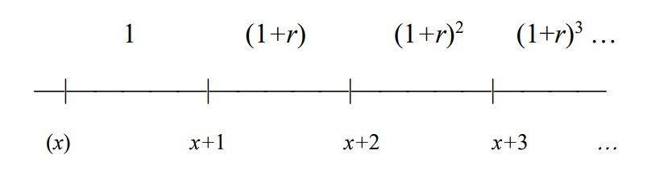

```{r setup, include=FALSE}
knitr::opts_chunk$set(echo = TRUE)
```

### Introducción

En este documento se desarrollan las primas de distintos productos de seguros de vida, 
con base en la tabla colombiana de mortalidad 1998-2003 y una tasa de interés técnico.

### Bases Técnicas

- Tabla: Colombiana de mortalidad de asegurados 1998-2003  
- Interés técnico bruto:

```{r}
i <- 0.051 + 0.025
v <- 1 / (1 + i)
```

### Preliminares

Para los siguientes casos se creó una tabla de mortalidad con los siguientes valores:

```{r}
process_mortality_table <- function(text_content, interest, save_copy = TRUE) {
  # Split text into lines
  lines <- unlist(strsplit(text_content, "\n"))
  
  # Find lines that appear to contain table data, based on the presence of numbers
  table_lines <- grep("^[[:space:]]*[0-9]{2,}", lines, value = TRUE)
  
  # Define a function to process each line and extract numeric data
  process_line <- function(line) {
    # Remove commas from numbers
    line <- gsub(",", "", line)
    # Split the line into component values
    values <- unlist(strsplit(line, "[[:space:]]+"))
    # Remove empty strings
    values <- values[values != ""]
    # Convert values to numeric
    as.numeric(values)
  }
  
  # Apply the function to each line to get a list of numeric vectors
  numeric_lines <- lapply(table_lines, process_line)
  
  # Combine numeric vectors into a matrix
  mortality_matrix <- do.call(rbind, numeric_lines)
  
  # keep what matters
  mortality_matrix <- mortality_matrix[, c(1, 4, 9)]
  colnames(mortality_matrix) <- c("age", "q_men", "q_women")
  
  # A: I feel more confortable with dataframes
  mortality_table <- as.data.frame(mortality_matrix)
  
  # Parameters
  v = 1/(1+interest)
  
  
  mortality_table["dx_men"] = NA
  mortality_table["lx_men"] = NA
  mortality_table["dx_women"] = NA
  mortality_table["lx_women"] = NA
  
  mortality_table$lx_men[1] = 100000
  mortality_table$lx_women[1] = 100000
  
  for (i in 1:nrow(mortality_table)) {
    if (i != 1) {
      mortality_table$lx_men[i] = mortality_table$lx_men[i-1] - mortality_table$dx_men[i-1]
      mortality_table$lx_women[i] = mortality_table$lx_women[i-1] - mortality_table$dx_women[i-1]
    }
    mortality_table$dx_men[i] = mortality_table$lx_men[i] * mortality_table$q_men[i]
    mortality_table$dx_women[i] = mortality_table$lx_women[i] * mortality_table$q_women[i]
  }
  
  mortality_table <- mortality_table %>% mutate(
    Dx_men = lx_men*v^age,
    Dx_women = lx_women*v^age,
    Cx_men = Dx_men*v*q_men,
    Cx_women = Dx_women*v*q_women
  )
  
  mortality_table$Mx_men <- NA
  mortality_table$Mx_women <- NA
  sum_men = 0
  sum_women = 0
  for (i in 1:nrow(mortality_table)) {
    sum_men <- sum_men + mortality_table$Cx_men[nrow(mortality_table)+1-i]
    sum_women <- sum_women + mortality_table$Cx_women[nrow(mortality_table)+1-i]
    mortality_table$Mx_men[nrow(mortality_table)+1-i] <- sum_men
    mortality_table$Mx_women[nrow(mortality_table)+1-i] <- sum_women
  }
  
  mortality_table$Rx_men <- NA
  mortality_table$Rx_women <- NA
  sum_men = 0
  sum_women = 0
  for (i in 1:nrow(mortality_table)) {
    sum_men <- sum_men + mortality_table$Mx_men[nrow(mortality_table)+1-i]
    sum_women <- sum_women + mortality_table$Mx_women[nrow(mortality_table)+1-i]
    mortality_table$Rx_men[nrow(mortality_table)+1-i] <- sum_men
    mortality_table$Rx_women[nrow(mortality_table)+1-i] <- sum_women
  }
  
  mortality_table$Ax_men <- mortality_table$Mx_men/mortality_table$Dx_men
  mortality_table$Ax_women <- mortality_table$Mx_women/mortality_table$Dx_women
  
  mortality_table$IAx_men <- mortality_table$Rx_men/mortality_table$Dx_men
  mortality_table$IAx_women <- mortality_table$Rx_women/mortality_table$Dx_women
  
  mortality_matrix <- as.matrix(mortality_table)
  
  # Try to save a copy as RDS if requested, without breaking the function
  if (isTRUE(save_copy)) {
    tryCatch(
      {
        saveRDS(mortality_matrix, file = "mortality_table.rds")
      },
      error = function(e) {
        message("Could not save RDS copy: ", e$message)
      }
    )
  }
  
  # Return the matrix
  mortality_matrix
}

```

---

### Punto 1

Prima de un seguro entero fraccionario con crecimiento del valor asegurado con patrón aritmético cada año, conforme al siguiente esquema: 

```{r, echo=FALSE, out.width="50%", fig.align="center"}
knitr::include_graphics("Pr1.jpg")
```

```{r}
# Problem 1
price_case_11 <- function(x,
                     m,
                     r,
                     .mortality_file,
                     gender = "women",
                     interest) {

  mortality_table <- process_mortality_table(.mortality_file, interest)
  mortality_table <- as.data.frame(mortality_table)

  pos_in_table <- which(mortality_table[, "age"] == x)
  interest_m <- m * ((1 + interest)^(1 / m) - 1)

  if (gender == "women") {
    result1 <- mortality_table$IAx_women[pos_in_table] - mortality_table$Ax_women[pos_in_table]
    result2 <- mortality_table$Ax_women[pos_in_table] + r * result1
  } else if (gender == "men") {
    result1 <- mortality_table$IAx_men[pos_in_table] - mortality_table$Ax_men[pos_in_table]
    result2 <- mortality_table$Ax_men[pos_in_table] + r * result1
  }

  result <- interest / interest_m * result2
  
  # returns
  result
}
```

### Punto 2

prima de un seguro entero fraccionario con crecimiento del valor asegurado con patrón aritmético dentro de cada año, conforme al siguiente esquema:

```{r, echo=FALSE, out.width="50%", fig.align="center"}
knitr::include_graphics("pR2.jpg")
```

```{r}
#Problem2.5 
price_case_09 <- function(x,
                     m,
                     r,
                     .mortality_file,
                     gender = "women",
                     interest) {

  mortality_table <- process_mortality_table(.mortality_file, interest)
  mortality_table <- as.data.frame(mortality_table)

  pos_in_table <- which(mortality_table[, "age"] == x)
  interest_m <- m * ((1 + interest)^(1 / m) - 1)

  if (gender == "women") {
    result1 <- price_case_11(x, m, r, .mortality_file,
                        gender, interest)
    result2 <- mortality_table$Ax_women[pos_in_table] * r * (
      (interest - interest_m) / interest_m^2
    )
  } else if (gender == "men") {
    result1 <- price_case_11(x, m, r, .mortality_file,
                        gender, interest)
    result2 <- mortality_table$Ax_men[pos_in_table] * r * (
      (interest - interest_m) / interest_m^2
    )
  }
  
  result <- result1 + result2
  
  result
  
}


# Problem 2 in workshop
price_case_25 <- function(x,
                     m,
                     r,
                     .mortality_file,
                     gender = "women",
                     interest) {
  mortality_table <- process_mortality_table(.mortality_file, interest)
  mortality_table <- as.data.frame(mortality_table)
  
  pos_in_table <- which(mortality_table[, "age"] == x)
  interest_m <- m * ((1 + interest)^(1 / m) - 1)
  result1 <- price_case_09(x, m, r, .mortality_file,
                      gender, interest)
  
  if (gender == "women") {
    result2 <- (r * interest * mortality_table$Ax_women[pos_in_table]) / (m * interest_m)
  } else if (gender == "men") {
    result2 <- (r * interest * mortality_table$Ax_men[pos_in_table]) / (m * interest_m)
  }
  
  result <- result1 + result2
  
  result
}
```

### Punto 3

Prima de un seguro temporal fraccionario con crecimiento del valor asegurado con patrón
aritmético dentro de cada año, conforme al siguiente esquema: 

```{r, echo=FALSE, out.width="70%", fig.align="center"}
knitr::include_graphics("Pr3.jpg")
```

Para el seguro entregar adicionalmente el planteamiento del valor de la prima única y un desarrollo que la simplifique en términos de primas de $IA_{x:\overline{n}|}$ y $A_{x:\overline{n}|}$

```{r}
# NEW finite-term case:
# frac_pay = TRUE, frac_value = TRUE, initial_payment = "a", arithmetic
price_case_09_term <- function(x,
                               m,
                               r,
                               n,
                               .mortality_file,
                               gender = "women",
                               interest) {
  
  terms <- term_Ax_IAx(
    x = x,
    n = n,
    .mortality_file = .mortality_file,
    gender = gender,
    interest = interest
  )
  
  Ax_term  <- terms["Ax_term"]
  IAx_term <- terms["IAx_term"]
  
  interest_m <- m * ((1 + interest)^(1 / m) - 1)
  
  result <- (interest / interest_m) * ((1 - r) * Ax_term + r * IAx_term) +
    r * ((interest - interest_m) / (interest_m^2)) * Ax_term
  
  result
}
```

### Punto 4

Prima de un seguro dotal, obtenido al agregar un seguro dotal puro al anterior. 


```{r}
Problem4 <- function(x,
                     m,
                     r,
                     n,
                     .mortality_file,
                     gender = "women",
                     interest) {
  
  mortality_table <- process_mortality_table(.mortality_file, interest)
  mortality_table <- as.data.frame(mortality_table)
  
  pos_in_table <- which(mortality_table[, "age"] == x)
  interest_m <- m * ((1 + interest)^(1 / m) - 1)
  
  # Dotal
  
  v <- 1/(1+interest)
  mult <- 1
  if (gender == "women"){
    # p_vector <- mortality_table$q_women[pos_in_table]
    
    for (i in 0:(n-1)) {
      mult <- mult * (1 - mortality_table$q_women[pos_in_table + i])
    }
  } else if (gender == "men") {
    for (i in 0:(n-1)) {
      mult <- mult * (1 - mortality_table$q_men[pos_in_table + i])
    }
  }
  Ax1n <- (v^n)*mult
  
  # Life
  
  Axn1 <- price_case_09_term(x, m, r, n, .mortality_file,
                             gender, interest)
  
  
  result <- Ax1n + Axn1
  
  result
  
}
```

### Punto 5

Prima de un seguro entero fraccionario con crecimiento del valor asegurado con patrón geométrico cada año, conforme al siguiente esquema:

```{r, echo=FALSE, out.width="50%", fig.align="center"}

```

```{r}
price_case_15 <- function(x,
                          m,
                          r,
                          .mortality_file,
                          gender = "women",
                          interest) {
  
  # Modified interest rate for the geometric-growth reduction
  interest_star <- (interest - r) / (1 + r)
  
  # Build mortality table using the modified interest rate
  mortality_table <- process_mortality_table(.mortality_file, interest_star)
  mortality_table <- as.data.frame(mortality_table)
  
  # Position of age x in table
  pos_in_table <- which(mortality_table[, "age"] == x)
  
  if (length(pos_in_table) == 0) {
    stop("Age x was not found in mortality_table.")
  }
  
  # Equivalent nominal rate convertible m times per year, at the ORIGINAL rate
  interest_m <- m * ((1 + interest)^(1 / m) - 1)
  
  # Select Ax at the modified rate
  if (gender %in% c("women", "mujer", "female")) {
    Ax_star <- mortality_table$Ax_women[pos_in_table]
    
  } else if (gender %in% c("men", "hombre", "male")) {
    Ax_star <- mortality_table$Ax_men[pos_in_table]
    
  } else {
    stop("`gender` must be one of: women/mujer/female or men/hombre/male.")
  }
  
  # Final result
  result <- (interest / interest_m) * (Ax_star / (1 + r))
  
  # return
  result
}
```